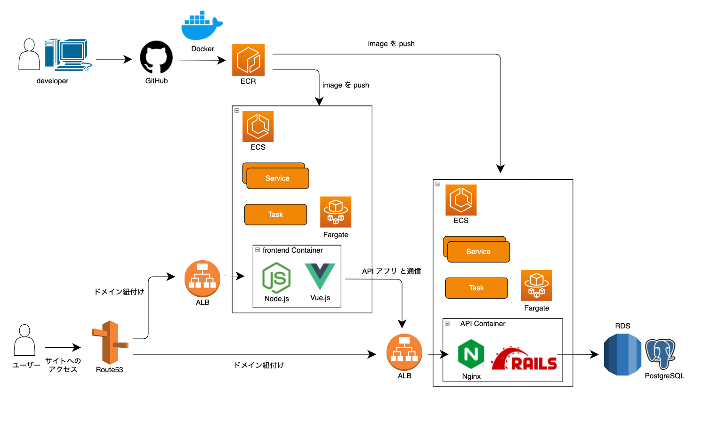
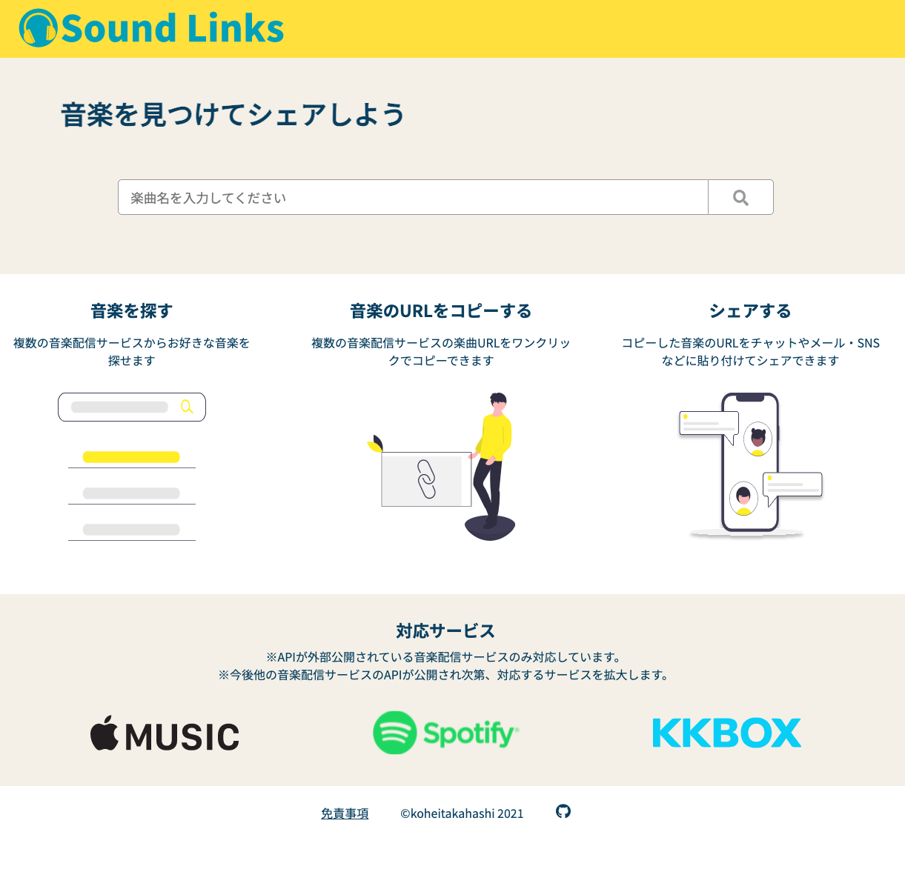

# SoundLinks

「SoundLinks」は、

「楽曲を共有したい時に、音楽配信サービスごとに楽曲のリンクを探すのが面倒という問題」を解決したい

「楽曲を共有したい人」 向けの、

「音楽プラットフォーム横断検索サービス」です。

ユーザーは「楽曲のタイトルを入力すると、各音楽配信サービス毎の楽曲リンクを取得すること」ができ、

「自分でそれぞれの音楽配信サービス内を検索して、リンクを取得する場合」とは違って、

「一度に複数の音楽配信サービスのリンクを取得できること」が備わっている事が特徴です。

音楽配信サービスの利用規約の問題から、SoundLinksで対応している音楽配信サービスは、APIが外部に公開されている必要があります。
そのため、[Spotify](https://www.spotify.com)・[Apple Music](https://www.apple.com/apple-music)・[KKBOX](https://www.kkbox.com/jp/ja) に対応しています。
他の音楽配信サービスにおいては、APIが公開され次第対応する予定です。

https://sound-links.com にてご利用できます。

## アプリの構成

このアプリは、APIとfrontendの2つのアプリから構成されます。

APIアプリはfrontendアプリからリクエストを受け取り、音楽配信サービスの各APIから楽曲情報を取得し、それをfrontendアプリに返します。Ruby on Railsで動いています。(apiディレクトリ配下)

frontendアプリは、ユーザーがアクセスする画面を提供するアプリです。Vue.js + TypeScript で動いています。(frontendディレクトリ配下)

## バージョン
### API
Ruby: 3.0.x

Ruby on Rails: 6.1.x

PostgreSQL: 13.2

### frontend
TypeScript: 4.2.3

Vue.js: 3.0.7

node:14.3

## 本番環境

このアプリの本番環境では以下のサービスを使用しています。

- CircleCI
  - CI・CDの実現
- AWS Elastic Container Registry(ECR)
  - コンテナイメージの保存
- AWS Elastic Container Service(ECS)
  - コンテナの管理
- AWS Route53
  - ドメインとコンテナの紐付け
- AWS Application Load Balancer(ALB)
  - ロードバランサ
- AWS Route53
  - ドメインとコンテナの紐付け
- AWS RDS PostgreSQL
  - データベース

以下が本番環境の構成図です。



## 開発環境の構築

以下、このアプリをローカル環境で動かすまでの手順を記載します。

### リポジトリのクローン

以下でリポジトリのクローンをしてください。

```shell
git clone git@github.com:koheitakahashi/sound_links.git
cd sound_links
```

### アプリのセットアップ

以下でAPIアプリとfrontendアプリのセットアップをします。
プロジェクトルートで実行してください。

```shell
docker-compose build
docker-compose run api bundle exec bin/setup
docker-compose run frontend npm rebuild node-sass 
```

APIアプリを動かすためにはSpotify・Apple Music・KKBOXのAPIキーを取得する必要があります。
各種APIキーの取得方法は、以下を参考にしてください。

※ Apple Music の API キーを取得するためには有料の Apple developers membership に登録する必要があります。

[App Settings \| Spotify for Developers](https://developer.spotify.com/documentation/general/guides/app-settings/#register-your-app)

[Getting Keys and Creating Tokens \| Apple Developer Documentation](https://developer.apple.com/documentation/applemusicapi/getting_keys_and_creating_tokens)

[KKBOX OpenAPI Documentation](https://docs-en.kkbox.codes/#overview--step-2-get-an-access-token)

APIキーを取得したら、apiコンテナ内に移動して、 `credentials.yml.enc` を編集します。

```shell
docker-compose exec api /bin/sh
bin/rails credentials:edit
```

`credentials.yml.enc` に以下のようにAPIキーをセットしてください。

```shell
spotify:
  client_id: #{取得したSpotifyのclient_id}
  client_secret: #{取得したSpotifyのsecret_key} 

kkbox:
  client_id: #{取得したKKBOXのclient_id}
  client_secret: #{取得したKKBOXのsecret_key} 

apple_music:
  team_id: #{取得したAppleMusicのclient_id}
  key_id: #{取得したAppleMusicのkey_id}
  private_key: #{取得したAppleMusicのprivate_key}
```

### アプリの起動

以下のコマンドで、dockerコンテナを立ち上げてください。
事前にdockerがインストールされていて、dockerが立ち上がっている必要があります。

```shell
docker-compose up
```

db・api・frontの各コンテナ以下のようなログが出力されたら無事起動したことになります。

dbコンテナのログ

```shell
db          | 2021-09-26 11:05:09.144 JST [1] LOG:  database system is ready to accept connections
```

apiコンテナのログ

```shell
api         | => Booting Puma
api         | => Rails 6.1.3.2 application starting in development
api         | => Run `bin/rails server --help` for more startup options
api         | Puma starting in single mode...
api         | * Version 4.3.8 (ruby 3.0.1-p64), codename: Mysterious Traveller
api         | * Min threads: 5, max threads: 5
api         | * Environment: development
api         | * Listening on tcp://0.0.0.0:3000
api         | Use Ctrl-C to stop
```

frontコンテナのログ

```shell
front       |   App running at:
front       |   - Local:   http://localhost:8080/
front       |
front       |   It seems you are running Vue CLI inside a container.
front       |   Access the dev server via http://localhost:<your container's external mapped port>/
front       |
front       | Issues checking in progress...
front       | No issues found.
```

### 動作確認

アプリの起動後、http://localhost:3000/ にアクセスして、以下のようなRailsの初期画面が表示されることを確認してください。


その後、http://localhost:8080/ にアクセスして、以下の画面が表示されることを確認してください。



最後に検索フォームにキーワードを入れて検索結果が表示されることを確認してください。

## lint、テストの実行
### APIアプリ

lintツールは[Rubocop](https://rubocop.org/) を採用しています。

apiコンテナ内において、以下のコマンドで実行できます。

```shell
docker-compose exec api /bin/sh
bundle exec rubocop
```

また、テストフレームワークはRSpecを採用しています。
apiコンテナ内において、以下でテストを実行できます。

```shell
bundle exec rspec
```

### frontendアプリ

lintツールは[eslint](https://eslint.org/) を採用しています。

frontendコンテナ内において、以下のコマンドで実行できます。

```shell
docker-compose exec frontend /bin/sh
yarn lint
```

また、テストフレームワークはユニットテストにjestを採用しています。(E2Eテストは準備中です。)
frontendコンテナ内において、以下でテストを実行できます。

```shell
yarn test:unit
```

## 不具合報告や機能追加の要望

不具合報告や機能追加の要望がありましたら、[issuesページ](https://github.com/koheitakahashi/sound_links/issues) にて issue を追加してください。

(機能追加・不具合報告のテンプレートを用意しておりますので、そちらに従って issue の追加をお願いします)
