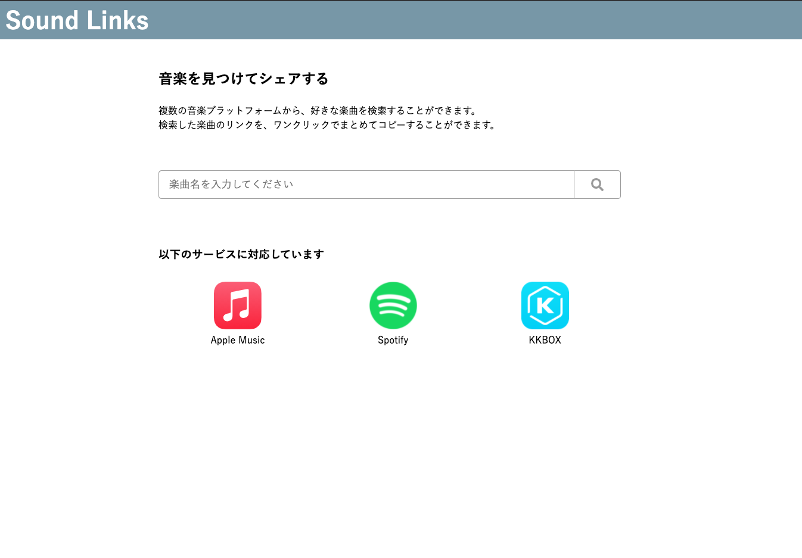

# Sound Linksとは

「Sound Links」は、

「楽曲を共有したい時に、プラットフォームごとに楽曲のリンクを探すのが面倒という問題」を解決したい

「楽曲を共有したい人」 向けの、

「音楽プラットフォーム横断検索サービス」です。

ユーザーは「楽曲のタイトルを入力すると、各プラットフォーム毎の楽曲リンクを取得すること」ができ、

「自分でプラットフォーム内を検索して、リンクを取得する場合」とは違って、

「一度に複数のプラットフォームのリンクを取得できること」が備わっている事が特徴です。

[Spotify](https://www.spotify.com)・[Apple Music](https://www.apple.com/apple-music )・[KKBOX](https://www.kkbox.com/jp/ja ) に対応しています。

https://sound-links.herokuapp.com/ にてご利用できます。

# バージョン
Ruby: 2.6.6

Ruby on Rails: 6.0.2

PostgreSQL: 13.2

TypeScript: 4.2.3

Vue.js: 3.0.7

# アプリのセットアップ

以下は開発者の方向けの情報です。

このリポジトリをローカル環境で動かすまでの手順を記載しています。

## インストール

以下でリポジトリのクローンと、各種パッケージのインストールを行なってください。

```shell
git clone git@github.com:koheitakahashi/sound_links.git
cd sound_links
bundle install
yarn install
```

## 各種 API キーのセット
このアプリを動かすためには、Spotify・Apple Music・KKBOXのAPIキーを取得する必要があります。
各種APIキーの取得方法は、以下を参考にしてください。

※ Apple Music の API キーを取得するためには有料の Apple developers membership に登録する必要があります。

[App Settings \| Spotify for Developers](https://developer.spotify.com/documentation/general/guides/app-settings/#register-your-app)

[Getting Keys and Creating Tokens \| Apple Developer Documentation](https://developer.apple.com/documentation/applemusicapi/getting_keys_and_creating_tokens)

[KKBOX OpenAPI Documentation](https://docs-en.kkbox.codes/#overview--step-2-get-an-access-token)

APIキーを取得したら、以下のコマンドで `credentials.yml.enc` を編集します。

```shell
bin/rails credentials:edit
```

`credentials.yml.enc` に以下のようにAPIキーをセットしてください。

```shell
spotify:
  client_id: #{取得したSpotifyのclient_id}
  client_secret: #{取得したSpotifyのsecret_key} 

kkbox:
  client_id: #{取得したKKBOXのclient_id}
  client_secret: #{取得したKKBOXのsecret_key} 

apple_music:
  team_id: #{取得したAppleMusicのclient_id}
  key_id: #{取得したAppleMusicのkey_id}
  private_key: #{取得したAppleMusicのprivate_key}
```

## データベースの作成

```shell
bin/rails db:prepare
```

## 動作確認

以下で、サーバーを立ち上げます。
```shell
# それぞれ別々のセッションで実行
bin/webpack-dev-server
bin/rails s
```

http://localhost:3000 にアクセスして、以下のページが表示されることを確認してください。
そして、検索フォームにキーワードを入れて検索結果が表示されることを確認してください。



# lint・フォーマッターの実行

以下の lint・フォーマッターを採用しています。

- [Rubocop](https://rubocop.org/)
- [eslint](https://eslint.org/)
- [stylelint](https://stylelint.io/)

以下のコマンドで、自動修正を実行できます。

```shell
bin/lint
```

# テストの実行

RSpec を採用しており、以下でテストを実行できます。

```shell
bundle exec rspec
```

また、[SimpleCov](https://github.com/simplecov-ruby/simplecov)を導入しているため、テスト実行後は以下でテストカバレッジを見れます。

```shell
 open coverage/index.html
```

# 不具合報告や機能追加の要望

不具合報告や機能追加の要望がありましたら、[issuesページ](https://github.com/koheitakahashi/sound_links/issues) にて issue を追加してください。

(機能追加・不具合報告のテンプレートを用意しておりますので、そちらに従って issue の追加をお願いします)
